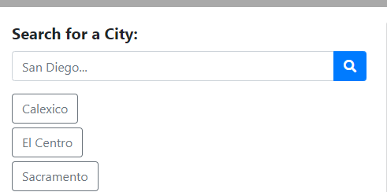
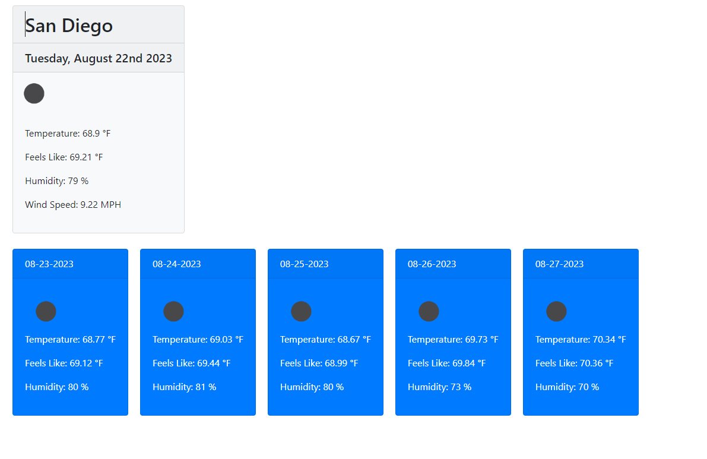

  # API-Weather-Dashboard
  
   

  ## Table-of-Contents

  * [Description](#description)
  * [Screenshots](#screenshots)
  * [Questions](#questions)
  
  ## [Description](#table-of-contents)

  It displays a city's weather information whenenever a user enter a city in the search bar

  ## [Screenshots](#table-of-contents)

  City input which asks for cities and also displays previously searched cities

  

  Information displayed once a city is selected

  

  ## [Questions](#table-of-contents)

  Please contact me using the following links:

  [GitHub](https://github.com/JoaquinGodina0)

  [Email: joaquingodina@icloud.com](mailto:joaquingodina@icloud.com)